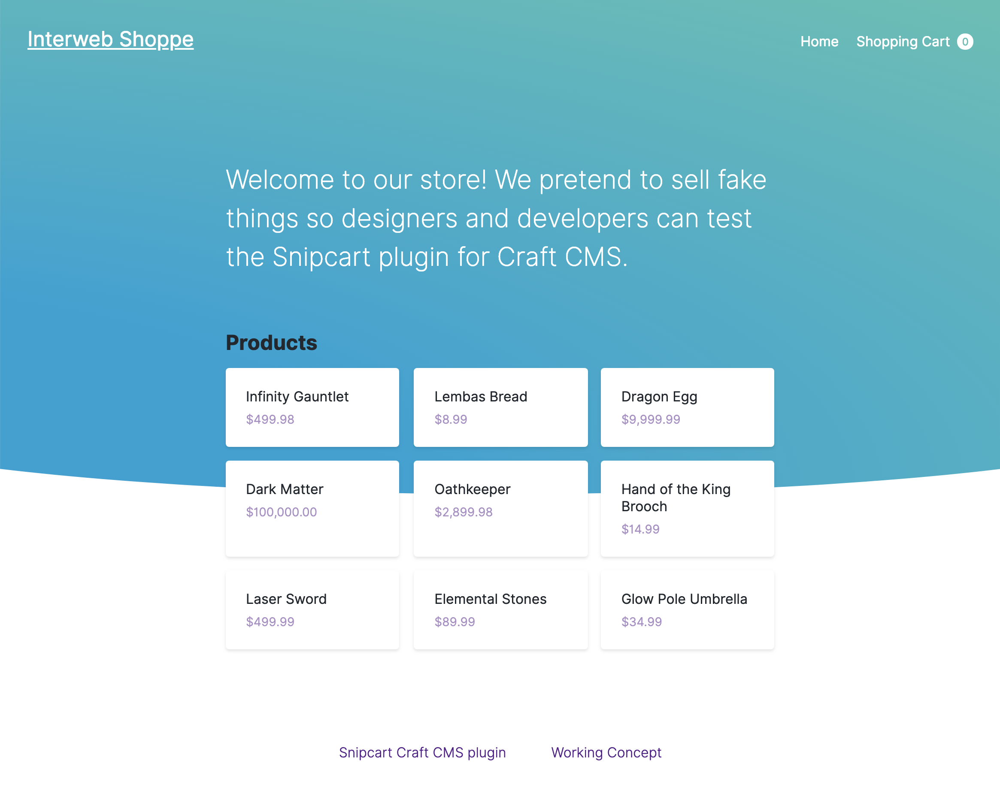
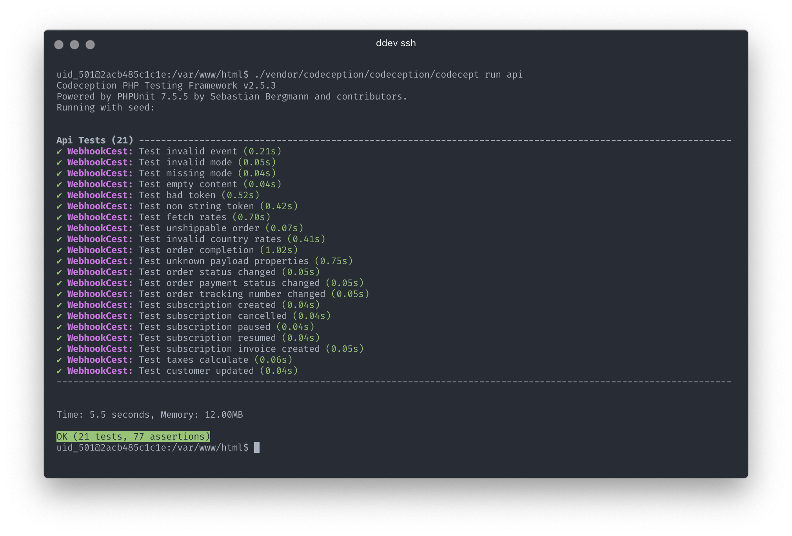

# Snipcart Plugin Test Project

A barebones test project for kicking the tires of [the Snipcart Craft CMS plugin](https://github.com/workingconcept/snipcart-craft-plugin) and making sure it behaves itself. BYO [Snipcart](https://snipcart.com/) and [ShipStation](https://www.shipstation.com/) API keys.





## Features

- [DDEV](https://github.com/drud/ddev) config for easy, Dockerized environment spin-up.
- All email is captured with Mailhog; nothing will be sent out.
- Shell script for initializing Craft install.
- Content migration for adding Section + fields + demo content.
- [Codeception](https://codeception.com/) API and acceptance tests.
- Shell script to sync local plugin changes into dev container.
- Barebones configuration and front-end.

## Goals

- Facilitate local *and* automated testing. (No manual control panel actions required.)
- Fully test the plugin in the context of a real Craft install.
- Keep it possible to change stack quickly to reproduce issues.

---

## Initial Setup

You can get this running in whatever environment you're used to. It's preconfigured for DDEV for fast spin-up.

[Install DDEV](https://ddev.readthedocs.io/en/stable/#installation), start the site with `ddev start`, and run the setup script from inside the container:

```shell
ddev ssh
./scripts/setup.sh
```

This will pull composer dependencies, install Craft, and install the Snipcart plugin. The site will be available at https://snipcart-test.ddev.local, and Mailhog will be running at http://snipcart-test.ddev.local:8025.

Log into the control panel at https://snipcart-test.ddev.local/admin with username and password `supersecret`.

Run the content migration separately to populate a Products section with fields and fake Entries.

## Testing Setup

There are currently two kinds of tests:

1. API tests that send data to the webhook endpoint to evaluate what comes back.
2. Acceptance tests that actually open a browser and do stuff on pages.

If you want to run the acceptance tests, and *only* if you want to run the acceptance tests, you'll need to either install Selenium and a Chrome driver or configure tests/acceptance.suite.yml to use your own setup.

**1. Install Selenium server and Chrome driver for browser testing.**

Selenium:

```shell
brew cask install java
brew cask info java

brew update
brew install selenium-server-standalone
```

ChromeDriver:

```shell
brew tap homebrew/cask
brew cask install chromedriver
```

**2. Run an instance of Selenium server before attempting browser tests.**

```shell
selenium-server
```

## Testing

Webhook/API tests require specific configuration to fully pass. These gotchas are documented with `WARNING` notes in [tests/api/WebhookCest.php](tests/api/WebhookCest.php). Requirements include...

- Setting valid Snipcart and ShipStation API keys.
- Completing all required ShipStation and Ship From fields.
- Enabling admin order email notifications with one email address.

Run tests **from inside DDEV container** (`ddev exec [command]` or `ddev ssh`):

```shell
ddev exec ./vendor/codeception/codeception/codecept run api
```

If there's a 500 response or something mysterious that could use more detail, run with the `--debug` flag.

Run tests **from outside DDEV container**:

```shell
./vendor/codeception/codeception/codecept run acceptance
```

Work with testing container locally:

```
docker run -d --name lemptest -p 8888:80 tonisormisson/dev-lemp
docker ps
docker exec -it [container-id] bash
```

Inspect emails from testing at http://snipcart-test.ddev.local:8025.

## Local Plugin + DDEV

This project is set up for testing and making live, local edits to the plugin source. You can edit composer.json like you normally would to have composer download a specific version of the plugin to /vendor, or you can use the existing setup to sync another local directory on your machine as detailed below.

**1. Make sure to require plugin at `@dev` version in composer.json.**

```json
"workingconcept/craft-snipcart": "@dev",
```

**2. Sync local plugin changes into the project, which is specifically important because DDEV's Docker container isn't going to love symlinks.**

`fswatch` is required:

```shell
brew install fswatch
```

Run sync, which watches and rsyncs changes into the project folder:

```shell
./.script/rsync-snipcart-dev.sh
```

**3. Point composer.json to a local repository we'll sync into the project dir.**

```json
  "repositories": [
    {
      "type": "path",
      "symlink": false,
      "url": "./plugins/snipcart/"
    },
  ]
```

```
composer update
```

## Share Local Server with ngrok

1. install ngrok with homebrew (`brew cask install ngrok`)
2. create ngrok account at ngrok.io
3. issue the offered `ngrok authtoken` command
4. `ngrok http 32770` (where 32770 is the project's web container port `docker ps | grep -- ddev-snipcart-test-web`)
